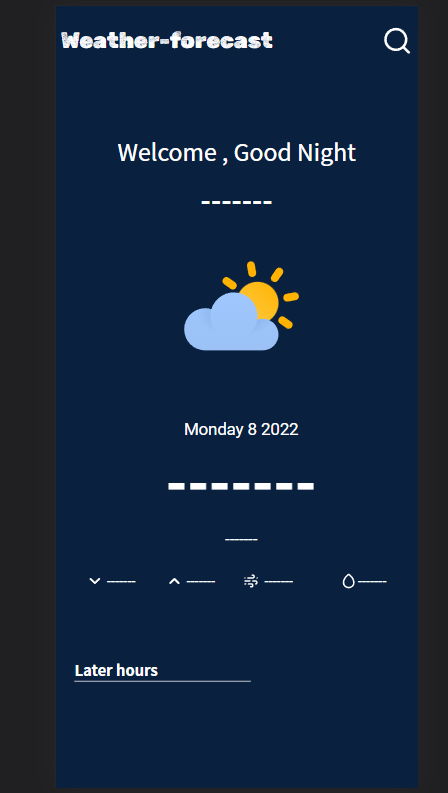
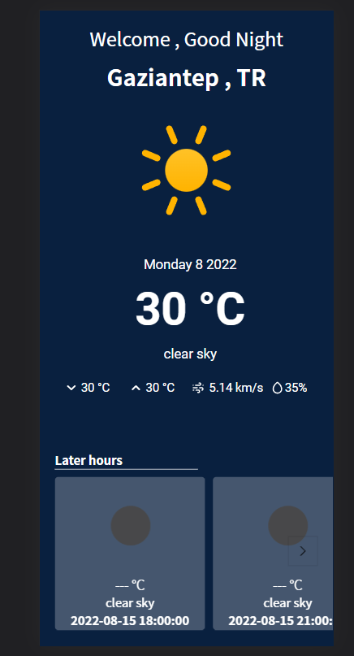

## weather-forecastApp

### ! Attention please enter from phones only
### [app demo](https://fancy-malabi-3c4ee5.netlify.app/)

### Hello, In this project, I want to make a presentation about the weather with [openweathermap](https://openweathermap.org/).With fetch api operations, the desired data is displayed on the interface.I show the weather information of the desired city, state. Another feature is that I show 14 hours of weather information at 3 hour intervals. My app is scalable and maintainable.

